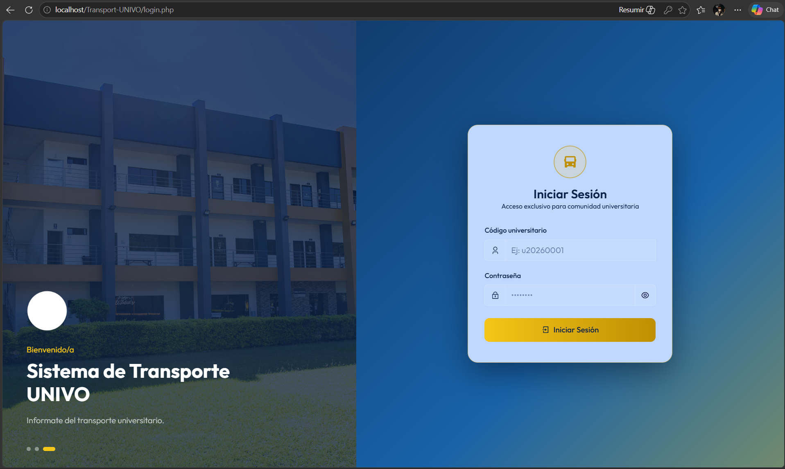
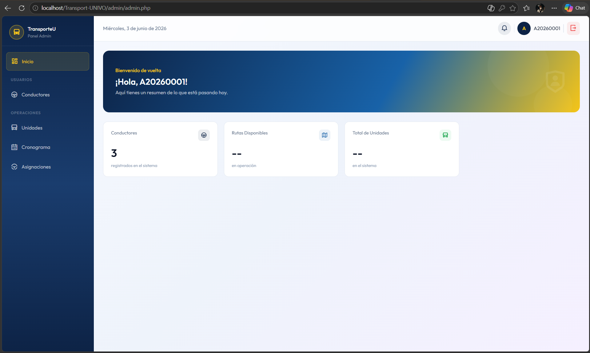
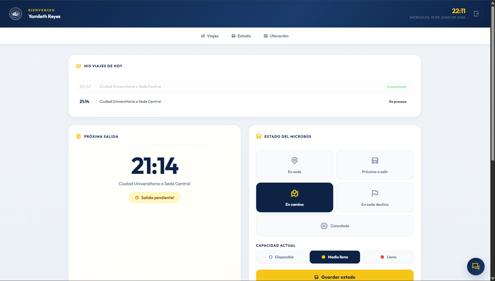

# 🚌 Transport-UNIVO

El proyecto consiste en el desarrollo de un sistema web de gestión y monitoreo del transporte universitario de la Universidad de Oriente (UNIVO), con el objetivo de mejorar la organización y el control del transporte entre sedes universitarias.

El sistema permitirá a estudiantes, docentes y personal administrativo conocer en tiempo real la ubicación, estado y nivel de ocupación del microbús mediante actualizaciones realizadas por el conductor. Asimismo, brindará información sobre horarios, rutas, tiempos estimados de llegada y notificaciones previas a la salida del transporte universitario.

El sistema contará con distintos roles:

- Administrador
- Conductor
- Pasajero

---

## 🎯 Objetivo

Diseñar e implementar una plataforma web que permita gestionar y monitorear el transporte universitario de la Universidad de Oriente, facilitando a los usuarios el acceso a información en tiempo real sobre horarios, ubicación, estado y capacidad del transporte.


---

## 💻 Tecnologías a utilizar

- PHP/HTML → Lógica y estructura del sistema
- JavaScript → Interactividad
- MySQL → Base de datos
- Bootstrap → Diseño responsivo
- Flowbite → Componentes UI
- Remix Icons → Iconografía
- Animate.css → Animaciones del sistema
- XAMPP → Entorno de desarrollo local

---

## 🚀 Instalación y Ejecución

Pasos detallados para instalar y ejecutar el proyecto en un entorno local.

### 1. Clonar el repositorio

En la terminal de Visual Studio Code ejecutar:

```bash
git clone https://github.com/key-sd/Transport-UNIVO.git
```

### 2. Iniciar el servidor local

Instalar XAMPP y activar los siguientes servicios:

- Apache
- MySQL

### 3. Mover la carpeta del proyecto

Mover la carpeta del proyecto a la siguiente ruta:

```txt
C:\xampp\htdocs\
```

### 4. Configurar la base de datos

- Ingresar a:

```txt
http://localhost/phpmyadmin/
```

- Crear una nueva base de datos con el siguiente nombre:

```txt
db_transport_univo
```

- Importar desde el repositorio Transport-UNIVO el script de la base de datos:

```txt
script.sql
```

### 5. Ejecutar el sistema

Abrir el navegador y acceder a:

```txt
http://localhost/Transport-UNIVO/
```

---

## 🔐 Credenciales del Sistema

### Administrador

- **Usuario:** a20260001
- **Contraseña:** adminpass

### Conductor

- **Usuario:** c0001
- **Contraseña:** conductorpass

### Pasajero

- **Usuario:** U20260003
- **Contraseña:** pasajeropass

---

## 👥 Equipo Responsable

En caso de dudas con la instalación, contactar a:

- **Nombre:** Flavia Valencia
- **Correo:** u20240609@univo.edu.sv

---

## 📸 Evidencias del Proyecto

### 🔐 Pantalla de Login


### 🛠️ Panel Administrador


### 🚍 Panel Conductor



---

## 📌 Versión del Sistema

v0.1 - Sprint 1

---

## 👨‍💻 Autor(es)

Shulton Dev's - Equipo de Desarrollo